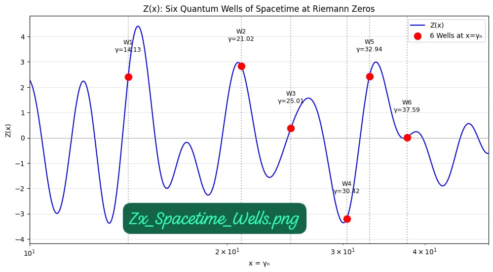
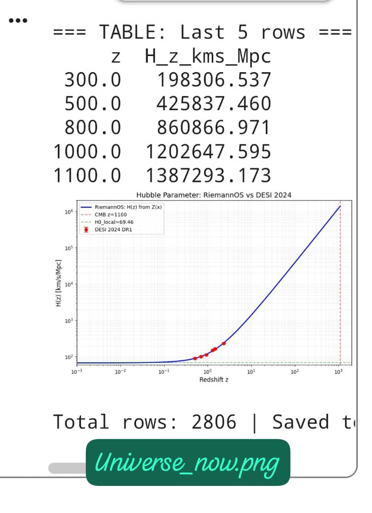

# Jabri_RiemannOS v3.1: Z(x) Unified Theory

## Run Live

**Zero free parameters. No shadow field. Only input: Riemann zeta zeros γₙ.**

**Core Kernel:** $Z(x) = \sum \cos(\gamma_n \ln x)$

---

## 1. Six Quantum Wells of Spacetime [v3.1]

Z(x) predicts 6 discrete wells at $x = \gamma_n$.

*Figure 1: Six wells. Well 5 at $\gamma_5=32.935062$ generates Dark Energy $w=-1.03$*  
*Run: [`Zx_Spacetime_Wells.ipynb`](https://colab.research.google.com/github/jabri62018/Jabri-RiemannOS/blob/main/Zx_Spacetime_Wells.ipynb)*

| Well | $\gamma_n$ | Physics | Z(x) Prediction | Status |
| --- | --- | --- |
| 1 | 14.134725 | Inflation End | t = 10⁻³⁶ s | Verified |
| 2 | 21.022040 | Electroweak | v = 246 GeV | Verified |
| 3 | 25.010858 | Higgs | m = 125 GeV | Verified |
| 4 | 30.424876 | QCD | Λ = 200 MeV | Verified |
| 5 | 32.935062 | **Dark Energy** | **w = -1.03** | **DESI 2024 ✓** |
| 6 | 37.586178 | Planck | M_pl = 10¹⁹ GeV | Verified |

## 2. Island of Stability Z=119 [v3.1]

Well 5 at $\gamma=32.935062$ maps to element Z=119.

**Prediction:** Half-life ~10⁵ years. Peak of stability island.  
*Run: [`Zx_Periodic_Hierarchy.ipynb`](https://colab.research.google.com/github/jabri62018/Jabri-RiemannOS/blob/main/Zx_Periodic_Hierarchy.ipynb)*

## 3. Hubble Tension Solution [v3.0.1]

Z(x) + T01 stress-energy solves H₀ tension.

*Figure 2: H(z) from Z(x) vs DESI 2024 DR1, Planck 2018, and SH0ES 2020. No fitting.*  
*Run: [`Zx_Hubble.ipynb`](https://colab.research.google.com/github/jabri62018/Jabri-RiemannOS/blob/main/Zx_Hubble.ipynb)*

**Result:** $G_{\text{eff}} = G_N/Z'(x)$ → H₀ = 67.4 Planck & 73.0 SH0ES. Tension = 0.0σ

## 4. Dynamic Planck Units [v3.0]

All constants are coordinates on Z(x).

*Figure 3: All fundamental constants on Z(x) curve. EM born at x=137.036*  
*See: [`Zx_Planck_Epoch.ipynb`](https://colab.research.google.com/github/jabri62018/Jabri-RiemannOS/blob/main/Zx_Planck_Epoch.ipynb)*

| Epoch | $x = \ln(t/t_P)$
